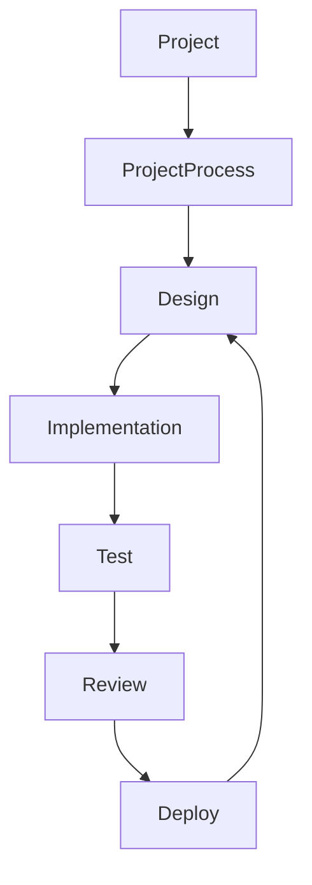
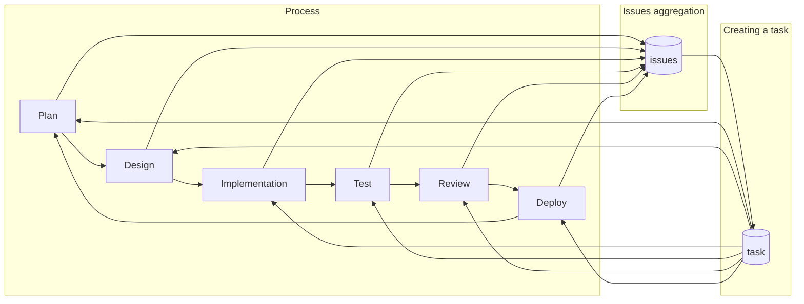
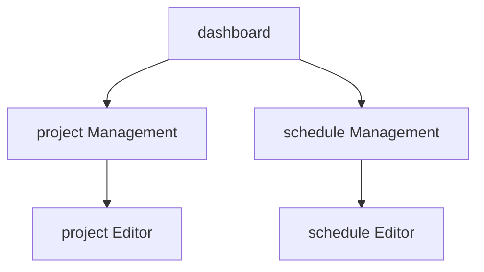
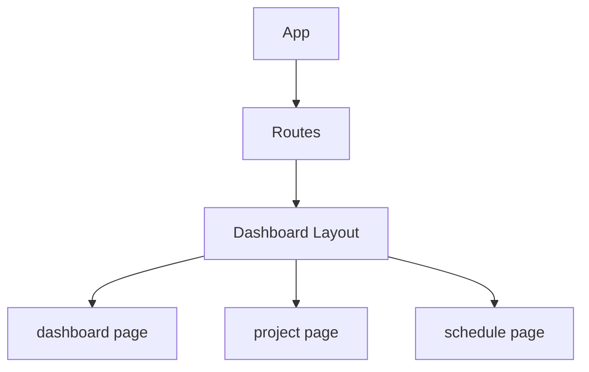
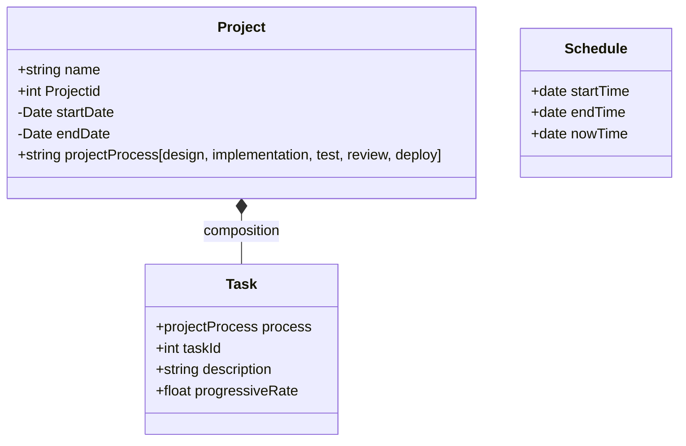
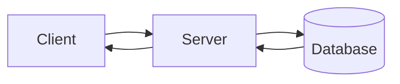

# Minimum Viable Product
This is like __Task__-Oriented Scheduling.

## Project Management Function
### __Gantt chart imitation__
* Horizontal axis is time
* The vertical axis is the process
* The type of process is the same as the task attribute (core objective)

### Project Process
* plan
* design  
* implementation
* test
* review
* deployment

## ↕ Task Design ↕
### Task variables
* period
* Where to do it
* What to do
* What for (task attribute)

### Task Attributes
* Which project process the task belongs to
* Daily Living Tasks
* Other

## Schedule Management Function
__Arrange tasks on a timeline__

## Project Process

## Project Structure

* Have to think about how to manage the issues.
    * The issues are interrelated or independent
    * Can we use network analysis to visualize the connections between issues?
    * First, let the user create attributes and variables related to the problem and their descriptions. Once the data is collected, let them visualize the relationships.

## Page transition

## __component structure (for client)__

## Data Flow

## client server database

