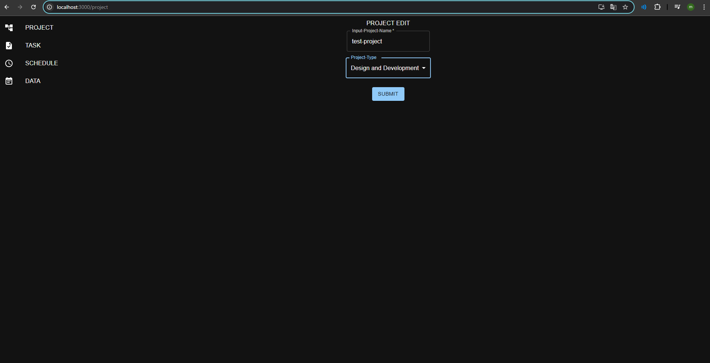
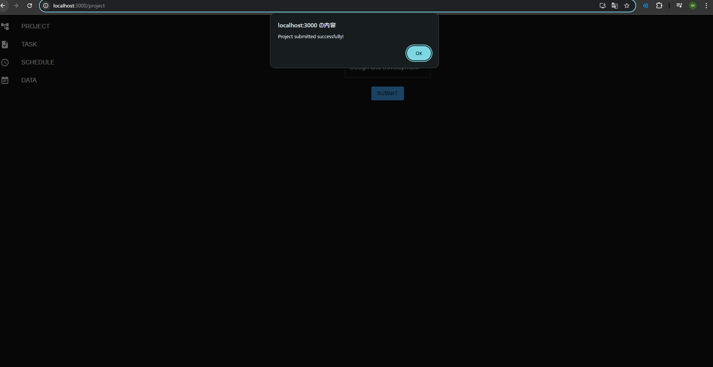
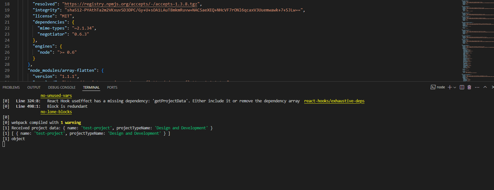
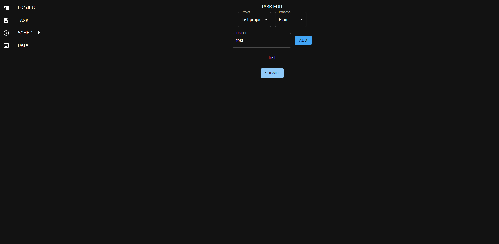
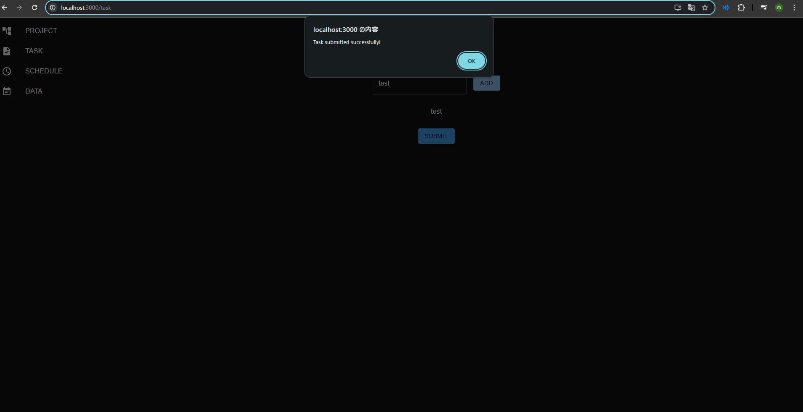
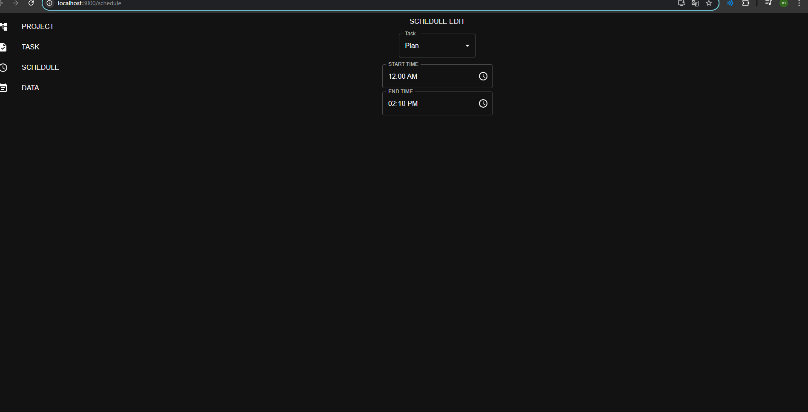
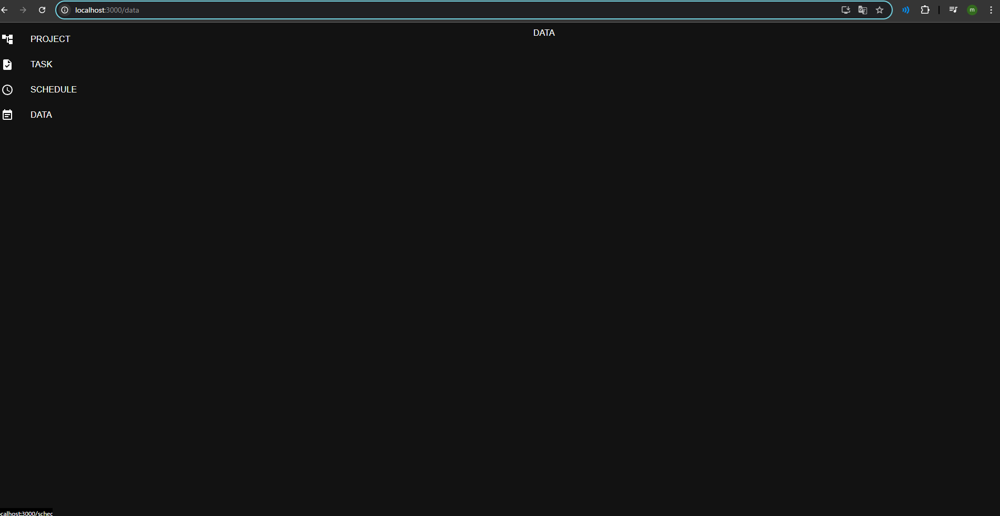

# task-scheduler

**DEMO**

---

1. `ProjectName`を入力 `ProjectType`を入力 `SUMIT`をクリック

2. `送信成功`アラートが表示

3. サーバ側ではjson形式の文字列を受信する

4. 次に、`TASK`タブから、タスクを入力する。このページでは、プロジェクトに基づいたタスクを入力することを想定している。

5. `SUBMIT`を押すことでサーバに文字列を送信する。

6. 最後に`schedule`タブでは、時間単位のスケジュールを管理することを想定している。

7. `DATA`タブでは、プロジェクトの進捗や、個人単位の統計情報などを表示することを想定している。

